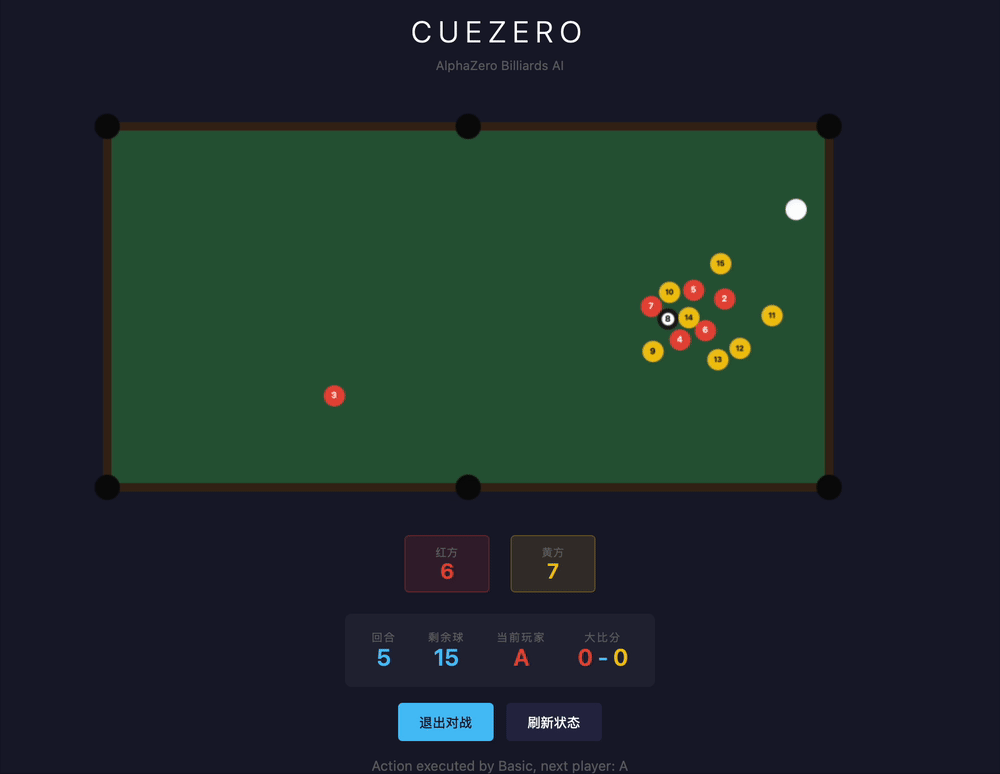

# CueZero: 高性能台球 AI 系统

[English](./README.md) | [中文](./README_zh.md)




## 📌 项目概述

CueZero 是一个高性能台球 AI 系统，将深度强化学习与专门设计的连续动作蒙特卡洛树搜索（MCTS）相结合。它解决了在高维连续状态和动作空间中进行决策的难题，同时处理复杂的物理动力学。

**核心亮点**：
- 81 维状态表示，5 维连续动作空间
- **极小模型（约 160K 参数）**，尽管台球比传统棋类更复杂
- 特制 MCTS 实现 **54 倍搜索空间压缩**
- 对抗规则型基线 Agent 达到 **95% 胜率**
- 在思源一号集群上，60 回合比赛 **< 3 分钟**
- MCTS-Fast 模式：消费级硬件上 **180 倍加速**（3 分钟 → 1 秒）

---

## 🎯 核心成果

### 对战表现

| 对手 | 胜率 | 评级 |
|------|------|------|
| BasicAgent | **95%** | 🏆 优秀 |
| BasicAgentPro | **80%** | 🏆 优秀 |

*测试条件：120 局比赛，4 的倍数轮换（先后手 × 球型分配）*

### 性能基准

| 指标 | 数值 |
|------|------|
| **完整比赛（60 回合）** | < 3 分钟（思源一号集群） |
| **MCTS-Full 决策** | 每杆约 3 分钟（消费级 PC） |
| **MCTS-Fast 决策** | 每杆约 1 秒（消费级 PC） |
| **搜索空间压缩** | 比暴力搜索小 54 倍 |
| **模型大小** | 约 160K 参数（非常小！） |
| **训练效率** | 约 200 轮学会基本操作 |
| **总训练轮次** | 约 1000 轮 |

### 硬件配置

**训练集群（思源一号）**：
- CPU：Intel Xeon ICX Platinum 8358
- GPU：NVIDIA HGX A100

**消费级部署**：
- MCTS-Fast 可在普通笔记本/台式机上运行

---

## 🚀 快速开始

### 前置要求
- Ubuntu 22.04（推荐）
- Python 3.13
- Conda

### 最小化安装

```bash
# 创建并激活 conda 环境
conda create -n poolenv python=3.13
conda activate poolenv

# 安装 pooltool 物理引擎
git clone https://github.com/SJTU-RL2/pooltool.git
cd pooltool
pip install "poetry==2.2.1"
poetry install --with=dev,docs
cd ..

# 安装 CueZero 依赖
pip install -r requirements.txt
pip install bayesian-optimization numpy
```

详细安装指南请参考 [docs/INSTALLATION.md](./docs/INSTALLATION.md)。

### 运行第一局比赛

```bash
# CLI：MCTS-Fast vs BasicAgent（5 局）
python scripts/cli_game.py --agent-a mcts_fast --agent-b basic --games 5

# Web UI（mock 模式，无需模型）
PYTHONPATH=. python -m server.server

# 带 AI 的 Web UI（需要 dual_network_final.pt）
PYTHONPATH=. python -m server.server --ai
```

访问 Web UI：http://localhost:8000

---

## 📂 系统架构

CueZero 的架构采用神经引导的搜索流水线：

```
游戏状态（81D）
      │
      ▼
┌─────────────────────────────────┐
│  策略-价值网络                   │
│  - 共享特征提取器                │
│  - 策略头（5D 动作）            │
│  - 价值头（胜率）                │
└─────────────┬───────────────────┘
              │
              ▼
┌─────────────────────────────────┐
│  连续动作 MCTS                   │
│  - 幽灵球启发式                  │
│  - 策略引导剪枝                  │
│  - 混合评估                      │
└─────────────┬───────────────────┘
              │
              ▼
      最优击球动作（5D）
```

### 核心组件

1. **策略-价值网络**：接收连续 3 局 81D 状态，输出 5D 动作分布和胜率
2. **连续动作 MCTS**：专为台球设计，结合启发式搜索和策略引导
3. **自对弈流水线**：自动数据生成和迭代模型改进
4. **物理仿真**：与 pooltool 集成实现精确的环境建模

深入技术原理请参考 [docs/HOW_IT_WORKS.md](./docs/HOW_IT_WORKS.md)。

---

## 🔧 工程亮点

### 1. 面向复杂任务的轻量化模型架构

**挑战**：台球本质上比国际象棋/围棋等传统棋类更复杂，具有连续物理、随机结果和高维状态/动作空间。

**解决方案**：精心设计的轻量化网络：
- **共享特征提取器**：2 层全连接 + GRU 用于时空特征融合
- **策略头**：2 层全连接用于 5D 动作预测
- **价值头**：2 层全连接用于胜率估计
- **总参数量**：仅 **约 160K**（极其紧凑！）

**为什么有效**：智能的架构设计优先关注本质特征（球的位置、速度、进袋状态），同时避免不必要的复杂性。尽管模型很小，仍能取得强大的性能。

### 2. 连续动作空间的特制 MCTS

**挑战**：5D 连续动作空间，即使采用粗略离散化也有约 243,000+ 种潜在组合。

**解决方案**：
- **幽灵球启发式**：几何生成约 30 个高质量候选
- **策略引导剪枝**：保留前 2/3 候选（减少 66%）
- **结果**：搜索空间缩小 54 倍（4,500 次评估 vs 243,000 种组合）

```
暴力搜索：243,000 种组合
CueZero：    4,500 次评估
──────────────────────────────
压缩率：      54 倍！
```

### 3. 双 MCTS 模式适配不同场景

| 特性 | MCTS-Full | MCTS-Fast |
|------|-----------|-----------|
| 模拟次数 | 150 | 30 |
| 最大深度 | 4 | 2 |
| 超时时间 | 15s | 3s |
| 决策时间 | ~3 分钟（消费级 PC） | ~1 秒（消费级 PC） |
| 对战 Basic 胜率 | 95% | 90% |
| 使用场景 | 强对弈 | 实时、Web UI |

**MCTS-Fast**：180 倍加速，仅牺牲 5% 胜率。

### 4. 高效训练流水线

- **预训练**：约 200 轮 BasicAgent 数据（学习基本击球）
- **自对弈训练**：约 600 轮，MCTS 引导的数据生成
- **补充训练**：约 200 轮，专门化优化
- **总计**：约 1000 轮达到完整性能

**关键优化**：与朴素强化学习相比，启发式搜索将训练速度提升 3-5 倍。

完整训练文档请参考 [docs/TRAINING.md](./docs/TRAINING.md)。

### 5. 混合评估策略

结合神经网络预测与物理仿真：
- **浅层深度**：更多仿真（准确但较慢）
- **深层深度**：更多网络（快速但略不准确）
- **动态加权**：基于搜索深度平滑过渡

---

## 📖 文档

| 文档 | 描述 |
|------|------|
| [docs/INSTALLATION.md](./docs/INSTALLATION.md) | 详细安装和环境配置指南 |
| [docs/TRAINING.md](./docs/TRAINING.md) | 完整训练流水线和自对弈文档 |
| [docs/PERFORMANCE.md](./docs/PERFORMANCE.md) | 性能基准和优化细节 |
| [docs/HOW_IT_WORKS.md](./docs/HOW_IT_WORKS.md) | 架构和算法的深入技术解析 |

---

## 🎮 使用示例

### CLI 对战

```bash
# 人类 vs MCTS-Full
python scripts/cli_game.py --agent-a human --agent-b mcts_full --games 3

# MCTS-Fast vs BasicAgentPro
python scripts/cli_game.py --agent-a mcts_fast --agent-b basic_pro --games 10

# 查看所有选项
python scripts/cli_game.py --help
```

### Web UI

```bash
# 使用默认 Agent 启动
PYTHONPATH=. python -m server.server --agent-a mcts_fast --agent-b basic
```

### REST API

```bash
# 开始新对战
curl -X POST http://localhost:8000/api/battle/start \
  -H "Content-Type: application/json" \
  -d '{"agent_a_type": "human", "agent_b_type": "mcts_fast", "total_games": 3}'

# 执行下一步
curl -X POST http://localhost:8000/api/battle/{battle_id}/next \
  -H "Content-Type: application/json" -d '{}'
```

### Agent 类型

| 类型 | 描述 | 使用场景 |
|------|------|----------|
| `human` | 通过 CLI/Web UI 的人类玩家 | 人机对战 |
| `mcts_fast` | 快速 MCTS（30 次模拟，深度 2，3 秒） | 实时对战、Web UI |
| `mcts_full` | 完整 MCTS（150 次模拟，深度 4，15 秒） | 强对弈、离线分析 |
| `policy` | 策略网络直接输出 | 快速推理 |
| `basic` | 启发式规则型 | 基线对比 |
| `basic_pro` | 增强物理型 | 高级基线 |
| `random` | 随机动作 | 测试、调试 |

---

## 🙏 致谢

本项目的计算结果得到了**上海交通大学高性能计算中心思源一号集群**的支持和帮助。

本项目最初作为上海交通大学的课程项目开发，随后被完善为独立的工程项目。实现灵感来自 AlphaZero 原理，并针对连续动作台球的独特挑战进行了适配。

---

## 📄 许可证

MIT 许可证 - 详见 LICENSE 文件。

---

## 🔗 相关链接

- [pooltool](https://github.com/SJTU-RL2/pooltool) - 台球物理引擎
- [AlphaZero](https://deepmind.google/discover/blog/alphazero-shedding-new-light-on-chess-shogi-and-go/) - 本项目的灵感来源
